# Diagrama de Classes do Iphone

## Introdução

Seguindo as orientações da atividade, foi feita abaixo o diagrama de classe com base as descrições do lançamento do *Iphone* em 2007. Está bastante detalhado, contendo as classes e métodos baseados na demonstração de *Steven Jobs*. Segue abaixo o diagrama:

## Diagrama

```mermaid

classDiagram
    Iphone -- BotaoFisico: possui
    Iphone -- Sincronizacao: possui
    Iphone -- Camera: possui
    Iphone -- Entrada: possui
    Iphone -- Som: emite
    Iphone -- Microfone: possui
    Iphone -- Sensores: possui
    Iphone -- Reprodutor: tem
    Iphone -- Telefone: utiliza
    Iphone -- MensagemDeTexto: envia
    Iphone -- Safari: navega pelo
    Iphone -- Email: envia
    Iphone -- Contato: possui
    Iphone -- GoogleMaps: possui
    Iphone -- Clima: possui
    Iphone -- Widget: possui
    Email <|-- ContatoDeEmail
    Som -- Volume: controla
    Contato <|-- ContatoDeTelefone
    Contato <|-- ContatoDeEmail
    ReprodutorDeVideo -- Som: controla
    ReprodutorDeMusica -- Som: controla
    GoogleMaps ..|> MapaComum
    GoogleMaps ..|> MapaPorSatelite
    BotaoFisico ..|> Home
    BotaoFisico ..|> Volume
    BotaoFisico ..|> Silecioso
    BotaoFisico ..|> Power
    Entrada ..|> EntradaFoneDeOuvido
    Entrada ..|> CartaoSIM
    Entrada ..|> ConectorIpod
    Sensores ..|> SensorDeProximidade
    Sensores ..|> Acelerometro
    Reprodutor ..|> ReprodutorDeMusica
    Reprodutor ..|> ReprodutorDeVideo
    ReprodutorDeMusica "1" -- "1..*" Musica: possui
    ReprodutorDeVideo "1" -- "1..*" Video: possui
    Telefone "1" -- "1..*" ContatoDeTelefone: possui
    Telefone "1" -- "1" Chamada: realiza
    Telefone "1" -- "1" CorreioDeVoz: toca
    

    class Reprodutor{
        +controlador()
        +pesquisar()
        +reproduzir()
        +pausar()
        +passarParaProximo()
        +passarParaAnterior()
    }

    class Sensores{
        +sentir()
    }

    class Entrada{
        +conectar()
    }

    class Som{
        -saidaDeSom
        +emitirSom()
    }

    class Microfone{
        -entradaDeAudio
        +receberAudio()
    }

    class BotaoFisico{
        +acionarBotao()
    }

    class Home{
        -botaoHome
        +acionarBotao()
    }

    class Silecioso{
        -modoSilencioso
        -modoSom
        +silenciar()
        +tocar()
    }

    class Volume{
        -maisVolume
        -menosVolume
        +aumentarVolume()
        +diminuirVolume()
    }

    class Power{
        -botaoLigaEDesliga
        -bloqueioDeTela
        +ligarIPhone()
        +desligarIphone()
        +bloquearTela()
    }

    class Sincronizacao{
        -sincronia
        +sicronizarIphone()
    }

    class Camera{
        -foto
        +tirarFoto()
    }

    class EntradaFoneDeOuvido{
        -conexao
        +conectar()
    }

    class CartaoSIM{
        -conexao
        +conetar()
    }

    class ConectorIpod{
        -conexao
        +conectar()
    }

    class SensorDeProximidade{
        -medicaoDeDistancia
        +sentir()
    }

    class Acelerometro{
        -medicaoDoAcelerometro
        +sentir()
    }

    class Musica{
        -notaDeMusica
        -nomeDeMusica
        -artistaDaMusica
        -detalhesDaMusica
        +getNomeDaMusica()
        +getNotaDaMusica()
        +setNotaDaMusica(int nota)
        +getArtistaDaMusica()
        +getDetalhesDaMusica()
    }

    class Video{
        -nomeDoVideo
        -detalhesDoVideo
        +getNomeDoVideo()
        +getDetalhesDoVideo()
    }

    class ReprodutorDeMusica{
        -musicas
        -volume
        +controlador()
        +avaliarMusica()
        +pesquisar(Musica musica)
        +controlarVolume(int volume)
        +pesquisarAlbum()
        +pesquisarPlaylist()
        +reproduzir()
        +pausar()
        +passarParaProximo()
        +passarParaAnterior()
    }

    class ReprodutorDeVideo{
        -videos
        +controlador()
        +pesquisar()
        +reproduzir()
        +pausar()
        +passarParaProximo()
        +passarParaAnterior()        
    }

    class Telefone{
        -contatos
        -chamada
        -correioDeVoz
        +realizarChamada()
        +pesquisarContatos()
        +ligar()
        +discarNumero()
        +pesquisarCorreioDeVoz()
        +enviarMensagemDeVoz()
        +adicionarFavoritos()
        +listarRecentes()
    }

    class CorreioDeVoz{
        -infomacoesDaMensagemDeVoz
        -nomeDoRemetente
        +ouvirMensagemDeVoz()
        +deletarMensagemDeVoz()
    }

    class Contato{
        -nomeDoContato
        -numeroDoContato
        -infomacoesDoContato
        +getNomeDoContato()
        +getMeioDeContato()*
        +getInformacoesDoContato()        
    }

    class ContatoDeTelefone{
        -nomeDoContato
        -numeroDoContato
        -infomacoesDoContato
        +getNomeDoContato()
        +getMeioDeContato()*
        +getInformacoesDoContato()
    }

    class Chamada{
        -contatosDeConferencia
        +realizarConferencia()
        +enviarMensagemDeVoz()
    }

    class MensagemDeTexto{
        -contatos
        +pesquisarContato()
        +DigitarMensagemDeTexto()
        +enviarMensagemDeTexto()
    }

    class Safari{
        +pesquisarUrl()
        +realizarZoom()
    }

    class ContatoDeEmail{
        -nomeDoContato
        -emailDoContato
        -infomacoesDoContato
        +getNomeDoContato()*
        +getMeioDeContato()
        +getInformacoesDoContato()        
    }

    class Email{
        -contatos
        +escreverEmail()
        +enviarEmail()
    }

    class GoogleMaps{
        +pesquisarEndereco()
        -listarDadosDePesquisa()
    }

    class MapaComum{
        +pesquisarEndereco()
        -listarDadosDePesquisa()
    }

    class MapaPorSatelite{
        +pesquisarEndereco()
        -listarDadosDePesquisa()
    }

    class Clima{
        +verClima()
    }

    class Widget{
        +verAcoesDaBolsa()
    }
```

